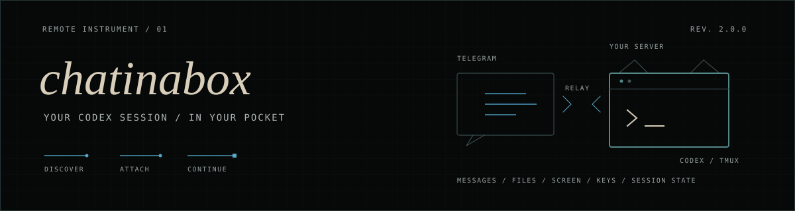

<p align="center">
  
</p>

Chatinabox lets you use the Codex CLI running on your server from Telegram.
Each work topic is tied to a real Codex session, so you can leave, come back,
and carry on with the same thread, workspace, tools, and terminal.

[Quick start](#quick-start) · [First run](#first-run) ·
[Commands](#telegram-controls) · [Architecture](docs/ARCHITECTURE.md) ·
[Security](SECURITY.md) · [Changelog](CHANGELOG.md)

Codex still does the actual work. Chatinabox takes care of finding sessions,
routing messages, and making the command-line experience comfortable inside
Telegram.

Chatinabox is an independent open-source project, not an OpenAI product.

> [!CAUTION]
> An allowed Telegram account controls a full-access Codex process on the host.
> Use a dedicated VPS without unrelated secrets or workloads. Read
> [SECURITY.md](SECURITY.md) before installing.

## What it does

- Send prompts and receive progress, thinking, final replies, files, and images.
- Keep one Codex session attached to each Telegram topic.
- Create, resume, rename, interrupt, and switch sessions without opening a
  terminal.
- See which topics are working, ready, or sleeping from one overview.
- Use a manager topic to start work and move between sessions.
- Keep completed replies pinned as checkpoints in each topic.
- Queue follow-up messages, send safe terminal keys, and post terminal
  screenshots.
- Optionally transcribe voice notes with ElevenLabs Scribe v2.
- Optionally collect files and web apps from a session in one artifact shelf.

## Quick start

Use a dedicated Debian or Ubuntu VPS with systemd.

Required:

- Node.js 22.13 or newer, with npm
- git and tmux
- a recent Codex CLI, installed and logged in for `root`
- a Telegram bot token from [@BotFather](https://t.me/BotFather)

ImageMagick and Chrome/Chromium are optional; both are only needed for
`/screen`. ImageMagick is also used when setup prepares custom profile photos.

```sh
sudo npm install -g @openai/codex
sudo codex login

git clone https://github.com/somewhereafter/chatinabox.git
cd chatinabox
sudo ./scripts/install.sh
```

The installer asks for the bot token, then shows a one-time `/claim` message.
Send that message to the bot in private and Chatinabox will confirm your
Telegram account automatically. You do not need a separate user-ID bot.

The installer checks the host and runs the test suite before changing anything.
It keeps existing tokens, settings, profiles, and session state during
upgrades, and rolls back if the new release does not start cleanly.

Non-interactive install:

```sh
sudo CHATINABOX_TG_BOT_TOKEN='123:secret' \
  CHATINABOX_TG_USER_ID='123456789' \
  ./scripts/install.sh
```

Check the host and source without installing:

```sh
sudo ./scripts/install.sh --dry-run
```

## First run

Open the bot in a private chat and send `/start`.

Setup happens through ordinary conversation. It can help you choose:

- the Telegram bot name and photo;
- the forum group name and photo;
- the dashboard and manager identities;
- default models, reasoning level, speed, and idle policy.

You get a preview before anything changes. Your choices are stored in
`/etc/chatinabox/profile.json` and survive upgrades.

For a forum, create a private supergroup, enable Topics, and add the bot as an
administrator. It needs permission to manage topics, pin and delete messages,
and change group info. In General, send:

```text
/forum setup
```

General becomes the Overview, and Chatinabox creates and connects the Manager
topic itself. Pin the Manager topic in Telegram's forum list.

Now create a topic for your first task. Its setup card opens automatically and
can start a new Codex chat, connect a running session, or resume a saved one.
You can also ask the Manager to create and coordinate work in plain language.
Chatinabox pins final responses inside each work topic as its checkpoint
history.

## Optional extras

### Voice notes

Add an ElevenLabs API key during installation:

```sh
sudo ELEVENLABS_API_KEY='your-key' ./scripts/install.sh
```

Telegram voice notes and audio uploads will then be transcribed with Scribe v2
before they are sent to Codex. Chatinabox replies to the original message with
the transcript, so you can see exactly what was heard. The language defaults to
English; `CHATINABOX_SCRIBE_LANGUAGE` and `CHATINABOX_SCRIBE_KEYTERMS` can be
used for other languages or technical terms.

### Artifact shelf

`chatinabox share` can send a file or link to Telegram and add it to the current
session's shelf. The shelf is optional; normal file and image delivery works
without it. If you want to set it up, see
[Artifact shelf setup](docs/ARTIFACT-PUBLISHER.md).

## Profile

The profile can also be changed directly from the host:

```sh
sudo chatinabox profile show --json
sudo chatinabox profile set \
  --assistant-name "mori" \
  --assistant-photo /path/to/bot-photo.png \
  --group-name "night shift" \
  --group-photo /path/to/group-photo.png \
  --json
sudo chatinabox profile set --idle-minutes 45 --complete --json
sudo chatinabox profile sync --json
```

Photos are normalized to square JPEG assets under
`/var/lib/chatinabox/profile-assets`. `profile sync` reapplies the configured
bot and forum identity after permissions change.

The default profile is in
[`ops/chatinabox-profile.json`](ops/chatinabox-profile.json).

## Telegram controls

| Command | Action |
| --- | --- |
| `/start` | Enter setup or open the session picker |
| `/settings` | Revisit the private profile |
| `/forum setup` | Prepare Overview and Manager from General |
| `/setup` | Reopen setup for the current work topic |
| `/overview setup` | Manually reserve this topic as Overview |
| `/manager setup` | Manually reserve this topic as Manager |
| `/codex` | List active and recent sessions |
| `/codex new [name]` | Start a worker in a new linked topic |
| `/codex rename name` | Rename the attached session |
| `/codex interrupt` | Interrupt the current turn |
| `/codex detach` | Open the manager topic |
| `/queue text` | Hold a message for the next turn |
| Voice note | Transcribe with Scribe v2 and send it as a prompt |
| `/screen` | Post the current terminal view |
| `/key KEY [KEY…]` | Send allowlisted terminal keys |
| `/help` | Show the full in-Telegram guide |

`/nexus` and `/wizard` remain aliases for older installs.

## Local control

Host-level commands should run as root. Creating a session here does not attach
it to Telegram by itself:

```sh
sudo chatinabox catalog --json
sudo chatinabox new "Investigate build" --cwd /root/project --json
```

The following commands are for agents running inside an attached Codex
session. Chatinabox uses that session to find the correct Telegram topic:

```sh
chatinabox self rename "Build investigation" --json
chatinabox new-and-handoff "New task" --cwd /root/project --json
chatinabox self lobby --json
chatinabox send-image /tmp/chart.png "Latest result" --json
```

Files and images are sent back to the Telegram topic attached to the current
session. Images created during a Telegram turn are forwarded there
automatically.

## Operations

```sh
sudo chatinabox doctor
systemctl status chatinabox chatinabox-bridge
git pull --ff-only
sudo ./scripts/install.sh
```

Pulling and running the installer creates and activates a new immutable
release. Running the installer without pulling simply reinstalls the current
checkout.

```sh
sudo ./scripts/uninstall.sh          # keep state and secrets
sudo ./scripts/uninstall.sh --purge  # remove everything
```

See [SECURITY.md](SECURITY.md) before exposing a bot to a real machine.

MIT.
